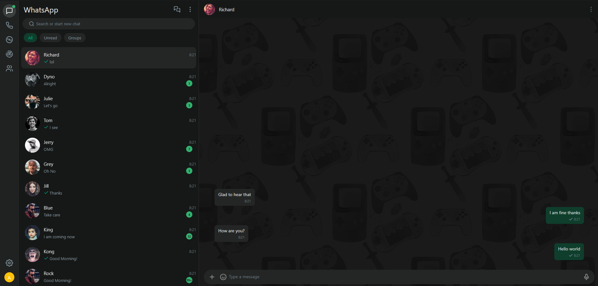

# WhatsApp Clone

A WhatsApp Web clone built with **Angular 19**, **Node.js**, **Express**, and **SQLite**.

---

## What's New

This project started as a simple Angular frontend prototype. It has since been rebuilt with a real backend and production-ready features:

| Feature | Before | After |
|---|---|---|
| **Authentication** | Mock — any username/password worked | Real — JWT-based auth with bcrypt password hashing |
| **Database** | None — state lost on refresh | SQLite — users persist between sessions |
| **Registration** | No registration form | Email, username, password with validation |
| **Login** | Just username | Login with email **or** username |
| **Routing** | Broken — no `<router-outlet>` | Fixed — proper route guards and navigation |
| **Avatars** | All external (pravatar.cc) | User gets colored initial avatar; contacts use random images |
| **Unread badges** | None | Per-conversation count badges + nav indicator dot |
| **Backend** | None | Express server with REST API |

---

## Architecture

```
Angular (:4200)  ──proxy──►  Express (:3000)  ──►  SQLite (file)
      │                            │
  JWT in localStorage         bcrypt hashing
  AuthInterceptor             CORS middleware
```

### Backend API

| Method | Endpoint | Auth | Purpose |
|---|---|---|---|
| POST | `/api/auth/register` | No | Create account |
| POST | `/api/auth/login` | No | Sign in (by email or username) |
| GET | `/api/auth/me` | JWT | Get current user |
| PUT | `/api/auth/profile` | JWT | Update display name / about |

---

## How to Run

```bash
npm install      # installs Angular + server dependencies
npm start        # launches both Angular (:4200) and Express (:3000)
```

Then open `http://localhost:4200` — click **Register** to create your first account.

---

## Screenshot



---

## Original Version

> This project was originally generated with [Angular CLI](https://github.com/angular/angular-cli) version 11.0.2 as a frontend-only prototype with mock authentication.


